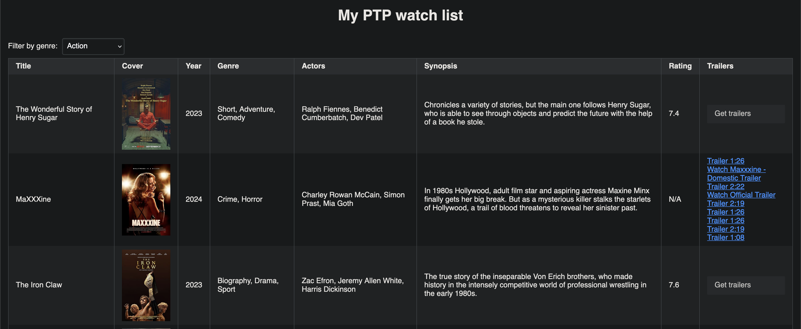

# PassThePopcorn Bookmarks UI

A PassThePopcorn bookmarks browser powered by sqlite and htmx

## Install

### Prerequisite

You only need sbcl:

``` shell
# Darwin
$ brew install sbcl

# Linux (install with your package manager of choice)
$ sudo apt install sbcl
```

### Build & run

``` shell
$ make build
$ ./ptp --port 8888 --file ~/Downloads/bookmarks.csv

...
Hunchentoot server is started.
Listening on 127.0.0.1:8888.
```

## Screenshot



